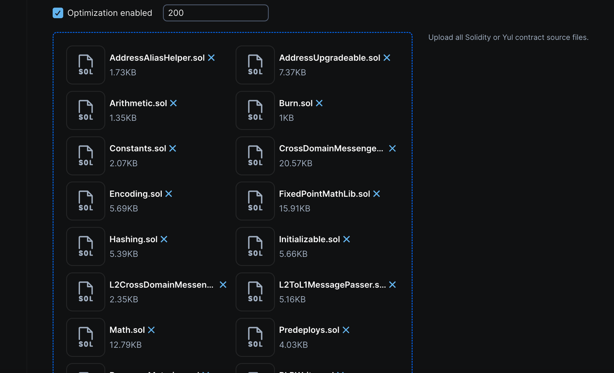
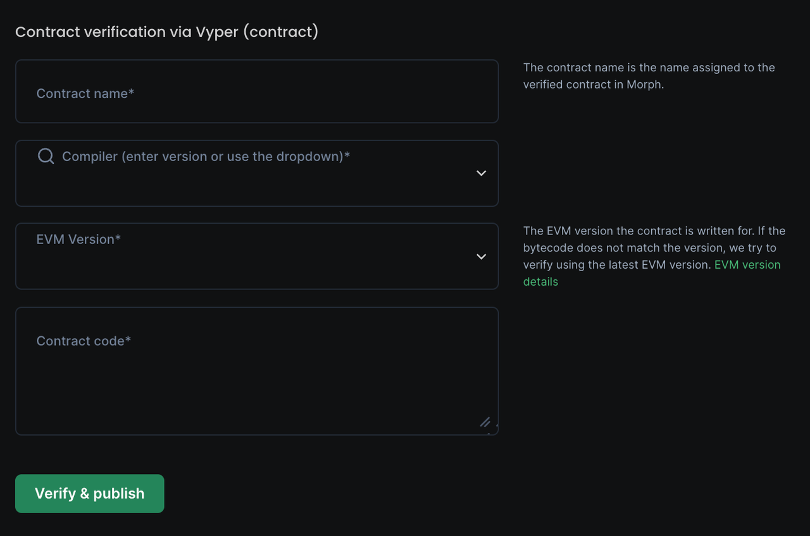
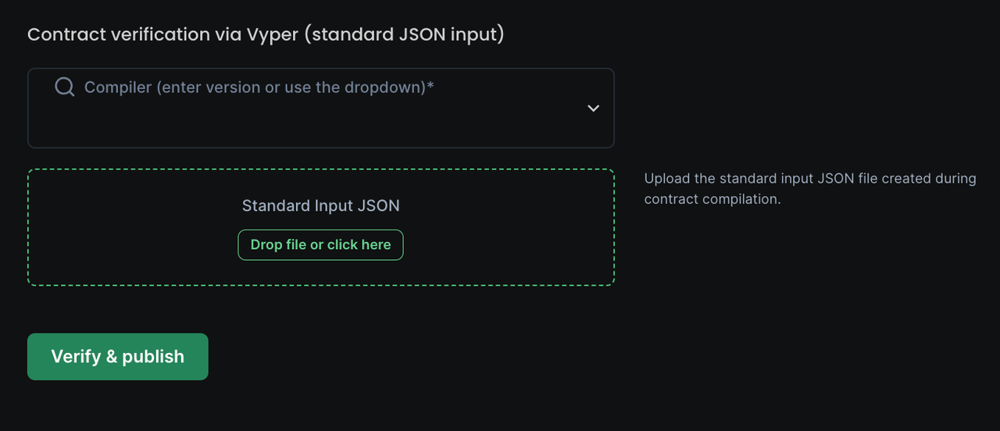
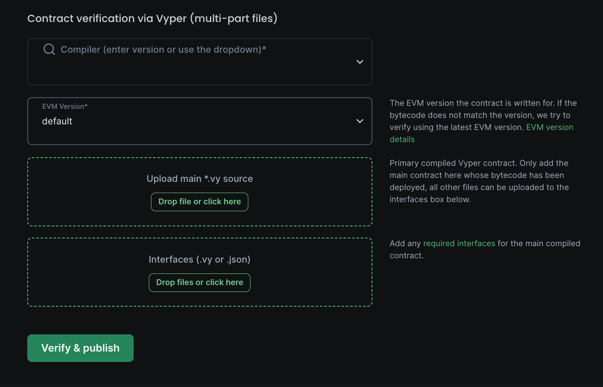
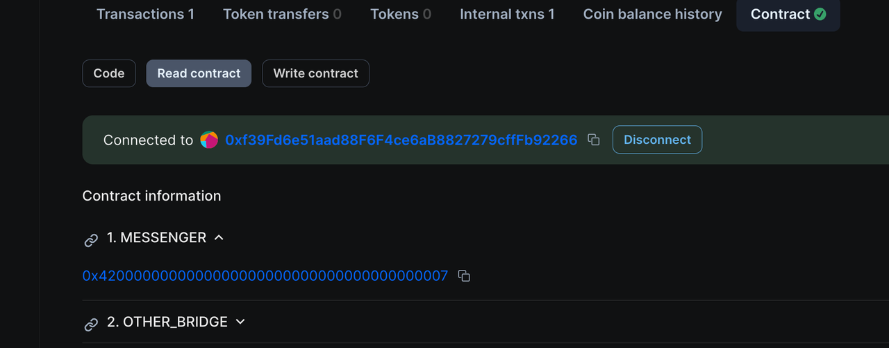

After deploying your smart contracts, it's important to verify your code on our [block explorer](https://explorer-testnet.morphl2.io). This can be done in an automated way using your develop framework such as hardhat.

## Verify with develop framework

Most smart contract tooling has plugins for verifying your contracts easily on Etherscan. Blockscout supports Etherscan's contract verification APIs, and it's straight forward to use these tools with the Morph Testnet.

### Hardhat

:::info

Use [harthat-verify plugin](https://hardhat.org/hardhat-runner/plugins/nomicfoundation-hardhat-verify)

:::

First run this under hardhat contract project directory:

~~~
yarn add --dev @nomiclabs/hardhat-etherscan
~~~

Then edit your 'hardhat.config.js' file to point to the Morph testnet RPC & explorer
> hardhat.config.js

~~~

require("@nomiclabs/hardhat-waffle");
require("@nomiclabs/hardhat-etherscan");
require('hardhat-deploy');

module.exports = {
    ...
    networks: {
    tMorph: {
      url: 'https://rpc-testnet.morphl2.io ' || '',
      accounts:
        process.env.PRIVATE_KEY !== undefined ? [process.env.PRIVATE_KEY] : [],
     },
    },
    ...
    etherscan: {
        apiKey: {
          tMorph: "abc",
        },
        customChains: [
          {
            network: "tMorph",
            chainId: 2710,
            urls: {
              apiURL: "",
              browserURL: "https://explorer-testnet.morphl2.io",
            },
          },
        ],
      }
}

~~~

When contract is deployed, adding a script: 
> scripts/lock.js

~~~
await hre.run("verify:verify", {
    address: contract.address, 
    constructorArguments: [xxx], 
});
~~~

Final step, execute

> NODE_ENV=devnet npx hardhat run scripts/lock.js --network devnet

To verify the contract code

## Vefiry with Morph explorer

- Visit：[Morph block explorer](https://explorer-testnet.morphl2.io)

We currently support 6 different ways to verify your contracts on our block explorer

There are 2 general parameters:

- Compiler: Has to be consistent with what you select when deployment
- Optimization: Can be ignored if no contract optimizatin, if has, has to be consistent with deployment

### Method: Solidity (Flattened Sources Code)

#### Frontend:

#### Flatten

Flatten through [forge command](https://book.getfoundry.sh/reference/forge/forge-flatten?highlight=flatten#forge-flatten), for example:

~~~
forge flatten --output FlattenedL2StandardBridge.sol ./contracts/L2/L2StandardBridge.sol
~~~

### Method: Solidity (Standard JSON Input)

#### Obtain JSON File

- Can be obtained through solc
- Can be obatined through remix compiler

### Method: Solidity (Multi-part files)

#### Frontend:

- You can submit multiple contract file by your own needs

#### SOL File Process
- If there is any imported file, it needs to be modified to be referenced by the same level path, and these files must be submitted together. 

### Method: Vyper (Contracts)

#### Frontend:

### Method: Vyper (Standard Json Input)

#### Frontend:

### Method: Vyper (Multi-part files)

#### Frontend:

### After Verification

