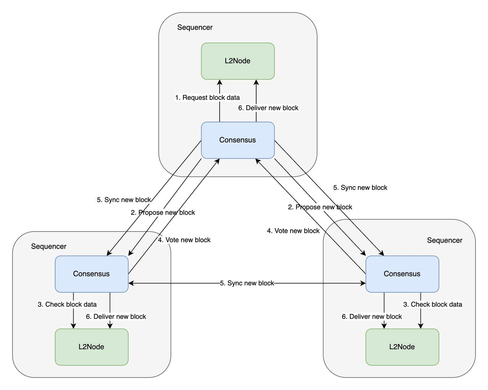

## TL;DR

1. For a long time, the centralized Sequencer of existing Rollup projects has been criticized. The centralized Sequencer brings risks of transaction review and MEV extraction, which contradicts the core concept of decentralization in the blockchain world. Therefore, decentralizing the Sequencer has become a problem that all Rollup projects must solve.

2. The decentralization of Sequencer requires the establishment of an efficient communication and consensus mechanism among Sequencer networks. Morph builds a decentralized Sequencer network based on the Tendermint consensus mechanism, which has been verified by the industry for its excellent performance in efficiency, robustness, and security. To fit in with the Rollup logic and improve L1-l2 security, BLS signature aggregated from Sequencer Set is also submitted in batch data.

3. The decentralized network of Sequencer also provides a key use case for our token $MORPH. Sequencer requires holding and staking $MORPH to participate in consensus, ensuring the security of the consensus network and challenge mechanism from an economic perspective.

::: tip <nbsp />

Our decentralized sequencer design is based on the [Tendermint Core](https://docs.tendermint.com/v0.34/) infra. Understanding the basics of Tendermint will help you understand our protocol design.

:::

## Sequencer Set Selection

In Morphism protocol, sequencers are selected on Layer1 based on the dPOS algorithm. Selected sequencers compose a sequencer set. L1 rollup contracts will need sequencer set's BLS signature to verify the correctness of the submitted batch data.
Blocks are not determined by single sequencer. New blocks need to pass the sequencer set consensus check to be excuted by excution layer.

## Consensus Basics
::: tip <nbsp />
 We recommend you to read our protocol's [modular design](./Architecture.md) before you get into the following description
:::

The consensus module is responsible for reaching consensus on block production, while L2 Node provides user transaction data for the consensus layer and also executes successfully-consensed L2 blocks through integration with the L2Geth execution layer. 

We use the tendermint-BFT consensus algorithm to determine the blocks of Layer2 and adjust it to fit the logic of L2 block generation.

## Block Consensus Process

1. Request block data
Consensus Module (Tendermint) run by selected sequencers will request the latest transactions from L2 Node 's mempool（along with other data as config）, L2 node will respond with block data (transactions and BLS sig) if there are enough txs to compose a block

2. Propose new block
After receiving the newest block data, the selected sequencer will propose and send the new block to the other Sequencers' Consensus layer.

3. Check block data
 Other Sequencers will check the received block data to make sure the block is valid and correct.

4. Vote new block
When finish checking, all sequencers will need to vote for the block, and blocks need to reach the consensus under Tendermint to be accepted as the passed new block. During votes, each sequencer will need to perform BLS signature on the required data (data that needs to be lnlcuded in the batches)

5. Sync & Deliver new block
Sequencers will sync the new block with each other and deliver the block to their L2Node to apply the state change.

## L1 Consensus results verify process

TBD